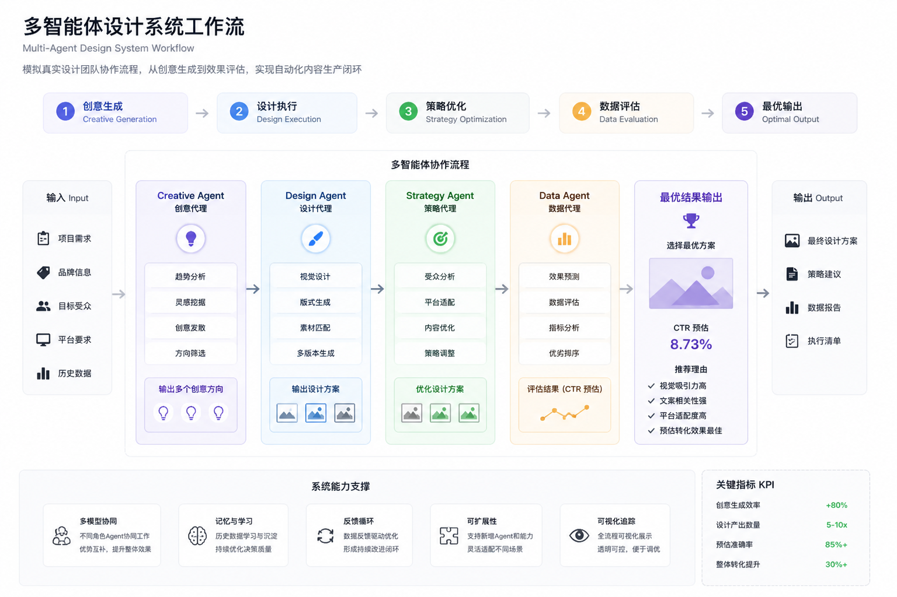

# 🧠 AI Design Team Operating System

<p align="center">
  
</p>

<p align="center">
  <b>Transform content production from human-driven workflows to system-driven pipelines</b>
</p>

---

## 🚀 Overview

AI Design Team Operating System is a **multi-agent collaboration system** that simulates a real design team workflow.

Instead of using AI as a single tool, this system orchestrates multiple agents to complete the full content production lifecycle — from idea generation to performance evaluation.

---

## 🧩 System Architecture

The system is composed of four core agents:

| Agent | Responsibility |
|------|----------------|
| 🎯 Creative Agent | Generate multiple creative directions |
| 🎨 Design Agent | Execute visual generation |
| 📊 Strategy Agent | Optimize for platform & audience |
| 📈 Data Agent | Evaluate performance and select best result |

---

## ⚙️ How It Works

1. Generate multiple creative directions  
2. Execute design variations  
3. Optimize for platform & audience  
4. Evaluate using simulated performance metrics  
5. Automatically select the best-performing result  

---

## 🖥️ Demo

Run locally:

```bash
pip install -r requirements.txt
streamlit run app.py
